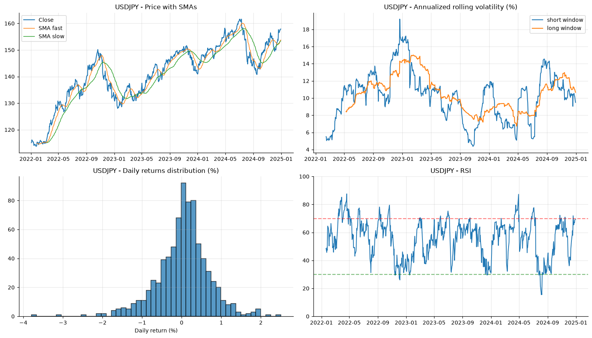
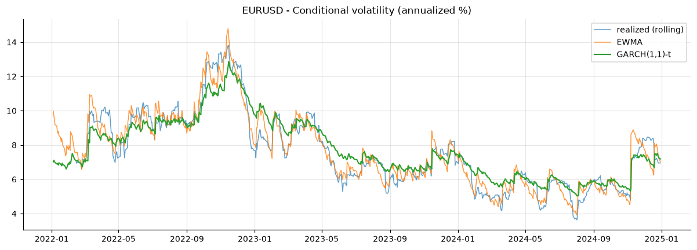
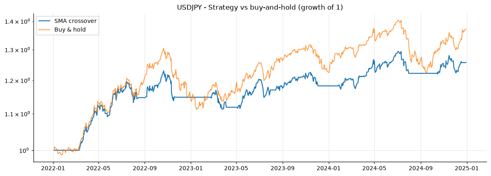

# FX Volatility, Risk & Strategy Analysis

[](https://github.com/dan-allouche-qf/forex-volatility-analysis/actions/workflows/ci.yml)

[](LICENSE)

A reproducible quantitative study of three FX majors — **EUR/USD, GBP/USD, USD/JPY** (daily, 2022–2024),
built around one research question:

> **Does conditioning FX risk on time-varying, fat-tailed volatility actually improve real risk
> *decisions* — VaR/ES coverage and exception independence — or is a parsimonious constant-variance
> model good enough?**

It runs the full apparatus to answer it: diagnostics → **GARCH conditional volatility** → **conditional
VaR/ES (GARCH-filtered + Filtered Historical Simulation) backtested against the unconditional model** →
ES backtesting (Acerbi–Székely) → **EVT tails** → a **volatility-targeted momentum strategy with
bootstrap Sharpe confidence intervals** → an out-of-sample vol-forecast race. Every number is produced by
tested code; none are asserted in prose.

📄 **Full write-up:** [compiled report (PDF)](report/report.pdf) · [REPORT.md](REPORT.md) (markdown, every computed table). · 🖥 **Interactive demo:** `streamlit run app/streamlit_app.py` · 📚 **Docs:** `mkdocs serve`

The analytics live in a small, **unit-tested package** (`src/fxvol/`); the notebook
(`notebooks/fx_volatility_analysis.ipynb`) is a thin narrative layer on top. The whole pipeline runs
from a **committed data snapshot**, so results reproduce from a clean clone with no network access, and
CI executes the notebook on every push.

---

## Key results

All figures below are computed in the notebook and collected in a single `KEY` dictionary (Section 19).

| Result | EUR/USD | GBP/USD | USD/JPY |
|---|---|---|---|
| 30-day ann. vol, peak (date) | 13.8% (2022-11-15) | 22.2% (2022-11-04) | 19.2% (2022-12-21) |
| Normality (Jarque–Bera) | **rejected** | **rejected** | **rejected** |
| ARCH effects (Engle LM) | yes | yes | weak |
| GARCH(1,1)-t persistence (α+β) | 0.998 | 0.988 | 0.988 |
| EVT tail index ξ (GPD on residuals) | 0.12 | 0.07 | 0.06 |
| GARCH-t **ES** backtest (Acerbi–Székely p) | 0.56 ✓ | 0.88 ✓ | **0.016 ✗** |
| SMA(20/50) Sharpe (95% bootstrap CI) | 0.18 [−0.9, 1.3] | 0.31 [−0.6, 1.3] | 0.95 [−0.2, 2.1] |

**The research question, answered — honestly.**
- **Conditioning improves VaR exception *independence*.** At the 95% level the unconditional Student-t VaR
  is mis-calibrated (Kupiec p = 0.013 EUR / 0.044 GBP, too few breaches), while the **GARCH-filtered and
  FHS conditional VaR are well-calibrated** (Kupiec p well above 0.05, independence p ≈ 0.8–0.9).
  Conditioning helps most where clustering is strong — the European pairs.
- **…but it is not a free lunch.** The GARCH-t **Expected Shortfall is rejected for USD/JPY**
  (Acerbi–Székely p = **0.016**, 11 tail breaches vs 5.3 expected): the conditional model *understates*
  USD/JPY tail risk — exactly the pair with weak in-sample ARCH — which is what motivates the **EVT** tail
  layer (positive GPD shape ξ confirms heavier-than-exponential tails).
- **Most "edges" are statistically indistinguishable from luck.** On ~750 daily observations **every**
  strategy Sharpe bootstrap **confidence interval straddles zero — including USD/JPY ([−0.2, 2.1])**; only
  USD/JPY reaches a Probabilistic Sharpe Ratio above 0.95, and even that rests on a single persistent
  trend. Saying so — rather than headlining a 0.95 Sharpe — is the result.
- **Fat tails are real, normality is not** (Jarque–Bera rejects normality for all three; excess kurtosis
  up to ~5.5 for GBP/USD), and a **common USD factor dominates** (first PC explains **70.7%** of joint
  return variance).
- **Forecasting:** conditional-vol models beat the constant-variance benchmark out-of-sample on QLIKE for
  the European pairs (Diebold–Mariano); the ranking is checked for range-based-proxy robustness.

| Per-pair dashboard | GARCH vs realized vol | Strategy vs buy-&-hold |
|---|---|---|
|  |  |  |

---

## Why this project looks the way it does

> **Methodological note — the bug that drove the redesign.** An earlier version reindexed the three
> Mon–Fri series onto a **full 365-day calendar** and *imputed* weekend/holiday prices with a recursive
> 5-day rolling mean. FX has no weekend prices, so **~28% (312 of 1,093 rows) were fabricated** by a
> smoothing filter. That corrupts every return, volatility, RSI and distributional statistic and makes the
> √252 annualization inconsistent with the data frequency. The imputation was **removed**: all metrics are
> computed on the native ~252-trading-day-per-year series, and a test (`tests/test_preprocessing.py`)
> guards against any weekend row ever re-entering the data. The corrected volatility peaks (13.8 / 22.2 /
> 19.2%) are materially different from — and lower than — the previously quoted figures.

This is the philosophy throughout: **honest data, tested math, every claim traceable to a printed value.**

---

## Repository structure

```
forex-volatility-analysis/
├── config.yaml                 # single source of truth (tickers, dates, windows, TRADING_DAYS, paths)
├── data/fx_ohlc_2022_2024.parquet   # committed snapshot (loaded by default, network-free)
├── src/fxvol/
│   ├── data.py                 # snapshot load / live refresh
│   ├── preprocessing.py        # trading-day alignment (NO calendar fabrication)
│   ├── indicators.py           # log returns, rolling & EWMA vol, SMA, RSI (Wilder/Cutler)
│   ├── risk.py                 # VaR/ES (hist + Student-t), drawdown, Sharpe/Sortino, Kupiec/Christoffersen
│   ├── models.py               # EWMA, GARCH(1,1)-t, walk-forward forecast, QLIKE/MSE, Diebold-Mariano
│   ├── diagnostics.py          # JB, ADF/KPSS, Ljung-Box, Engle ARCH-LM
│   ├── backtest.py             # vectorized SMA-crossover, lagged signals, costs, performance stats
│   └── plots.py                # dashboards, heatmap, vol overlay, QQ-plots, equity curves
├── notebooks/fx_volatility_analysis.ipynb   # narrative layer (outputs stripped; CI executes it)
├── figures/                    # exported PNGs referenced above
├── tests/                      # pytest: golden values, no-look-ahead, data integrity
├── pyproject.toml · requirements.txt
└── .github/workflows/ci.yml    # ruff + pytest + notebook execution
```

## Reproduce

```bash
make setup     # create venv, install package + dev tools (editable)
make test      # run the unit tests (golden values, no-look-ahead, data integrity)
make lint      # ruff
make run       # execute the notebook end-to-end, refreshing figures/ from the snapshot
```

Everything runs offline from `data/fx_ohlc_2022_2024.parquet` (pulled `2026-06-14`). To re-pull live data:
`make snapshot` (or `data.load_ohlc(refresh=True)`).

## What's tested

- **Indicator correctness** — Cutler RSI vs a hand-computed golden value; `annualized_vol == std·√252`;
  EWMA against the RiskMetrics recursion; SMA / log-return golden values.
- **Risk math** — VaR/ES cross-checks (historical ≈ normal on Gaussian data; t→normal as df→∞; ES > VaR);
  drawdown on a known path; Kupiec/Christoffersen calibration.
- **No look-ahead** — perturbing only the final price must not change any earlier strategy return.
- **Data integrity** — the aligned series has zero weekend rows and never exceeds the real trading calendar.

## Methodology (brief)

- **Returns:** log returns (time-additive). **Annualization:** factor = observations/year of the series
  (√252), kept consistent with the trading-day frequency.
- **Volatility:** rolling std, RiskMetrics **EWMA** (λ=0.94), and **GARCH(1,1) with Student-t** innovations
  (`arch`). Conditional vol is overlaid on realized vol per pair.
- **Risk:** 1-day VaR & Expected Shortfall (historical and Student-t) at 95%/99%, max drawdown, Sharpe,
  Sortino — and a rolling-window VaR **backtest** with Kupiec (unconditional) and Christoffersen
  (conditional) coverage tests.
- **Backtest:** SMA(20/50) long/flat, signals lagged one bar (next-bar execution), transaction costs on
  turnover, benchmarked against buy-and-hold; results presented with their losses, not just wins.
- **Forecasting:** expanding-window 1-day-ahead variance forecasts (GARCH / EWMA / rolling / constant-var)
  scored by **QLIKE** and **MSE**, compared with the **Diebold–Mariano** test.

## Caveats

Daily data and a 3-year window; the squared-return realized-variance proxy is noisy (QLIKE is robust to
it); the backtest uses a single textbook parameterization (no parameter search, by design, to avoid
overfitting). These are stated so the reader can weigh the conclusions.

## Author

Dan Allouche — MIT licensed.
